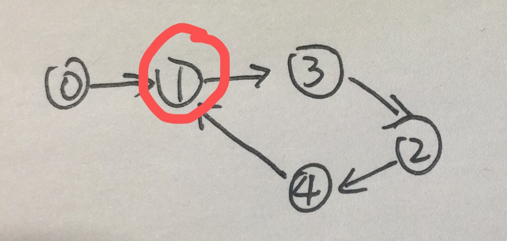

# 287. Find the Duplicate Number
@(LeetCode)[Meduim, Array, Two Pointers, Binary Search]

## Fast and Slow pointers
Input: [1,3,4,2,1]
|index|0|1|2|3|4|
|:--|
|num|1|3|4|2|1|
Graph:

Two pointers meet in the cycle.
Then use two pointer(same pace) to find the entry of  the cycle, which is the duplicate number.
```
class Solution {
    public int findDuplicate(int[] nums) {
        if (nums == null || nums.length < 1)
            return 0;
        int slow = nums[0], fast = nums[nums[0]];
        while (slow != fast) {
            slow = nums[slow];
            fast = nums[nums[fast]];
        }
        // find entry
        slow = 0;
        while (slow != fast) {
            slow = nums[slow];
            fast = nums[fast];
        }
        return slow;
    }
}
```

## Binary Search

```java
class Solution {
    public int findDuplicate(int[] nums) {
        if (nums == null || nums.length < 1)
            return 0;
        int lo = 1, hi = nums.length, mid;
        while (lo <= hi) {
            mid = (lo + hi) / 2;
            int cnt = 0;
            for (int n : nums) {
                if (n <= mid)
                    cnt++;
            }
            if (cnt <= mid) {
                lo = mid + 1;
            } else {
                hi = mid - 1;
            }
        }
        return lo;
    }
}
```