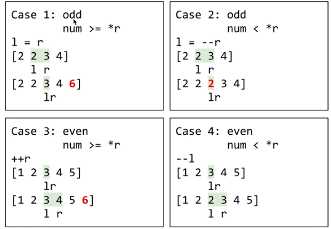

#  295. Find Median from Data Stream
@(LeetCode)[Hard, Array, Heap, BST]
#### Two Heaps
- Use two heaps (priority queue) *(in Java PQ is min heap)*
	- `small`: max heap of smaller half
	- `large`: min heap of larger half
- Negate the numbers in `small` to realize max heap with min heap
- `addNum()`: the size of `small` always <= `large`
- `findMedian()`: either the head of `large` or the average of  `small` "tail and `large` head

```java
public void addNum(int num) {
    large.add(num);
    small.add(-large.poll());
    if (small.size() > large.size()) {
        large.add(-small.poll());
    }
}

public double findMedian() {
    return small.size() < large.size() ? large.peek() : (large.peek() - small.peek()) / 2.0;
}

private Queue<Integer> small = new PriorityQueue();
private Queue<Integer> large = new PriorityQueue();
```

#### Use multiset in C++
- Use two pointers to track the median position in the tree
	- when size of tree is odd, the two pointers point to same number; else they point to the two number in the middle
	 
- `addNum()` : O(logn)



```cpp
class MedianFinder {
    multiset<int> data;
    multiset<int>::iterator lo_median, hi_median;

public:
    MedianFinder()
        : lo_median(data.end())
        , hi_median(data.end())
    {
    }

    void addNum(int num)
    {
        const size_t n = data.size();   // store previous size

        data.insert(num);               // insert into multiset

        if (!n) {
            // no elements before, one element now
            lo_median = hi_median = data.begin();
        }
        else if (n & 1) {
            // odd size before (i.e. lo == hi), even size now (i.e. hi = lo + 1)

            if (num < *lo_median)       // num < lo
                lo_median--;
            else                        // num >= hi
                hi_median++;            // insertion at end of equal range
        }
        else {
            // even size before (i.e. hi = lo + 1), odd size now (i.e. lo == hi)

            if (num > *lo_median && num < *hi_median) {
                lo_median++;                    // num in between lo and hi
                hi_median--;
            }
            else if (num >= *hi_median)         // num inserted after hi
                lo_median++;
            else                                // num <= lo < hi
                lo_median = --hi_median;        // insertion at end of equal range spoils lo
        }
    }

    double findMedian()
    {
        return (*lo_median + *hi_median) * 0.5;
    }
};
```

#### BST with Java
find prev and next node with in-order traversal

```java
class MedianFinder {
    class TreeNode {
        int val;
        TreeNode parent, left, right;

        TreeNode(int val, TreeNode parent) {
            this.val = val;
            this.parent = parent;
            left = null;
            right = null;
        }

        void add(int num) {
            if (num >= val) {
                // add to right subtree
                if (right == null) {
                    right = new TreeNode(num, this);
                } else {
                    right.add(num);
                }
            } else {
                // add to left subtree
                if (left == null) {
                    left = new TreeNode(num, this);
                } else {
                    left.add(num);
                }
            }
        }

        TreeNode nextNode() {
            TreeNode next;
            if (right != null) {
                // next is the leftmost of right subtree
                next = right;
                while (next.left != null) {
                    next = next.left;
                }
            } else {
                next = this;
                while (next.parent.right == next) {
                    // this is the only right child of its parent
                    // go up left until next is a left child
                    next = next.parent;
                }
                next = next.parent;
                // this is the rightmost of next's left subtree
            }
            return next;
        }

        TreeNode prevNode() {
            TreeNode prev;
            if (left != null) {
                prev = left;
                while (prev.right != null) {
                    prev = prev.right;
                }
            } else {
                prev = this;
                while (prev.parent.left == prev) {
                    prev = prev.parent;
                }
                prev = prev.parent;
            }
            return prev;
        }
    }

    private int size; // tree size
    TreeNode root, curr; // curr is median when size is odd, or middle left when size is even

    /** initialize your data structure here. */
    public MedianFinder() {

    }

    public void addNum(int num) {
        if (root == null) {
            root = new TreeNode(num, null);
            curr = root;
            size = 1;
        } else {
            root.add(num);
            size++;
            // update curr
            if (size % 2 == 1) {
                // size is odd
                if (curr.val <= num) {
                    curr = curr.nextNode();
                }
                // else curr stay same
            } else {
                // size is even
                if (curr.val > num) {
                    curr = curr.prevNode();
                }
            }
        }
    }

    public double findMedian() {
        if (size % 2 == 1) {
            return curr.val;
        } else {
            return (curr.val + curr.nextNode().val) / 2.0;
        }
    }
}
```