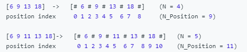

# 4. Median of Two Sorted Array
@(LeetCode)[Hard, Array, Binary Search]
#### 1
1. `n` is the length of two array. The median must be the average of `(n+1)/2`th and `(n+2)/2`th elements.
2. Recursively find the kth smallest elements from array `a[i:]` and `b[j:]`
	- Pre-check: 
		- if one of the array is exausted, the kth one must be in the other one
		- if k==1: compare the first element of two arrays
	- Binary Search: find `k/2`th element in `a` and `b` separately
	- Compare the median(`k/2`) of  remaining `a` and `b` and choose.
		- if aMid < bMid: the kth must not in `a[i: i+k/2`]. We move the start point of `a` by k/2.
		-  else: We move the start point of `b` by k/2
```cpp
 double kth(vector<int>& a, vector<int>& b, int i, int j, int k) {
	if (i >= a.size())
		return b[j + k - 1];
	if (j >= b.size())
		return a[i + k - 1];
	if (k == 1)
		return min(a[i], b[j]);

	int aMid = INT_MAX, bMid = INT_MAX;
	if (i + k / 2 - 1 < a.size())
		aMid = a[i + k / 2 - 1];
	if (j + k / 2 - 1 < b.size())
		bMid = b[j + k / 2 - 1];
	if (aMid < bMid)
		return kth(a, b, i + k / 2, j, k - k / 2);
	else
		return kth(a, b, i, j + k / 2, k - k / 2);
}
```
#### 2
1. Add a few imaginary 'positions' (represented as #'s) in between numbers, and treat numbers as 'positions' as well.
 
	 index(L) = (CutPosition-1)/2, index(R) = (CutPosition)/2.
2. For two array:
	3.  there are 2N1 + 2N2 + 2 position altogether. Therefore, there must be exactly N1 + N2 positions on each side of the cut, and 2 positions directly on the cut.
	4.  Therefore, when we cut at position C2 = K in A2, then the cut position in A1 must be C1 = N1 + N2 - k.
	5.  **L1 = A1[(C1-1)/2]; R1 = A1[C1/2];  L2 = A2[(C2-1)/2]; R2 = A2[C2/2];**
6.  To decide the cut position, we need to ensure `L1 <= R1 && L1 <= R2 && L2 <= R1 && L2 <= R2`, which can be simplified to `L1 <= R2 and L2 <= R1.` **Binary Search**
Therefore:
 - If we have L1 > R2, it means there are too many large numbers on the left half of A1, then we must move C1 to the left (i.e. move C2 to the right); 
 - If L2 > R1, then there are too many large numbers on the left half of A2, and we must move C2 to the left.
 - Otherwise, this cut is the right one. 
 - After we find the cut, the medium can be computed as (max(L1, L2) + min(R1, R2)) / 2;


```cpp
 double findMedianSortedArrays(vector<int>& nums1, vector<int>& nums2) {
    int N1 = nums1.size();
    int N2 = nums2.size();
    if (N1 < N2) return findMedianSortedArrays(nums2, nums1);	// Make sure A2 is the shorter one.
    
    int lo = 0, hi = N2 * 2;
    while (lo <= hi) {
        int mid2 = (lo + hi) / 2;   // Try Cut 2 
        int mid1 = N1 + N2 - mid2;  // Calculate Cut 1 accordingly
        
        double L1 = (mid1 == 0) ? INT_MIN : nums1[(mid1-1)/2];	// Get L1, R1, L2, R2 respectively
        double L2 = (mid2 == 0) ? INT_MIN : nums2[(mid2-1)/2];
        double R1 = (mid1 == N1 * 2) ? INT_MAX : nums1[(mid1)/2];
        double R2 = (mid2 == N2 * 2) ? INT_MAX : nums2[(mid2)/2];
        
        if (L1 > R2) lo = mid2 + 1;		// A1's lower half is too big; need to move C1 left (C2 right)
        else if (L2 > R1) hi = mid2 - 1;	// A2's lower half too big; need to move C2 left.
        else return (max(L1,L2) + min(R1, R2)) / 2;	// Otherwise, that's the right cut.
    }
    return -1;
} 
```