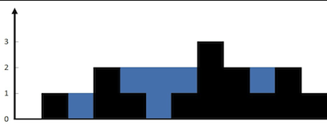

# 42. Trapping Rain Water
@(LeetCode)[Hard, Array, Two Pointers]
Two pointers `lo` and `hi`
Keep track of two var: `maxLo` and `maxHi`, which can be seen as the "wall" of each side. And accumulate water (width=1) as we move the pointers.

Input: 0,1,0,2,1,0,1,3,2,1,2,1
|lo|height[lo]|maxLo|hi|height[hi]|maxHi|res|
|:--|:--|:--|:--|:--|
|0|0|0|11|1|1|0|
|1|1|1|-|-|1|0|
|2|0|1|-|-|1|1|
|3|2|2|-|-|1|1|
|-|-|2|10|2|2|1|
|4|1|2|-|-|2|2|
|5|0|2|-|-|2|4|
|6|1|2|-|-|2|5|
|7|3|3|-|-|2|5|
|-|-|3|9|1|2|6|
|-|-|3|8|2|2|6|
|-|-|3|7|3|3|6|

```
class Solution {
    public int trap(int[] height) {
        int lo, hi, maxLo, maxHi, res;
        lo = 0;  hi = height.length - 1; maxLo = 0; maxHi = 0; res = 0;

        while (lo <= hi) {
            if (height[lo] <= height[hi]) {
                if (height[lo] >= maxLo)
                    maxLo = height[lo];
                else
                    res += maxLo - height[lo];
                lo++;
            } else {
                if (height[hi] >= maxHi)
                    maxHi = height[hi];
                else
                    res += maxHi - height[hi];
                hi--;
            }
        }
        return res;
    }
}
```